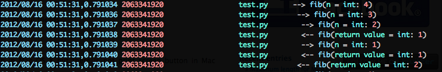
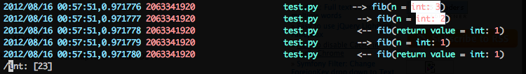
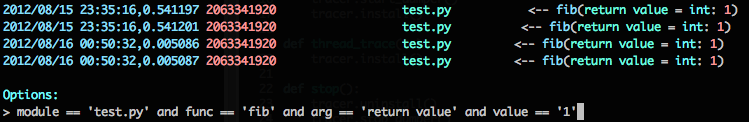
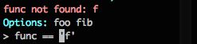

pytrace - a fast python tracer
==============================

pytrace records function calls, arguments and return values.

traces aid debugging, profiling and obviate logging.

Follow @alonhorev on twitter for updates.

Install
-------

	pip install pytrace

Usage
-----

Invoke pytrace with your script:

	$ pytrace foo.py --bar
	
Invoke the reader from the same directory by executing pytrace with no arguments:
	
	$ pytrace

The reader can be invoked while the script is running. providing 'online' debugging capabilities.

Reader
------

The collected data can be viewed in an interactive reader:

The reader can search for regular expressions:

The reader can filter traces using a python syntax:

The reader corrects queries that don't match anything:

The Database
------------

The database is saved in the current working directory and is named **traces.sqlite**.

In order to not run out of **disk space**, The database will be truncated to a fixed number of traces (currently hard coded to 10000). 

Reducing the overhead
---------------------

Hot functions can be skipped using a decorator:

	from pytrace import notrace
	
	@notrace
	def hot():
		pass

Trace specific packages:

	$ export TRACE_MODULES=/Users/alon/project

You can specify a colon (:) separated list of folders as well.

TODO
----

1. Extract to configuration: 
   1. size of shared memory.
   2. db path.
   3. max traces.
2. Add an option to ignore modules under site-packages.
3. Explicit tracing (logging).
4. Sort the arguments.
5. Scroll horizontally.
6. Ignore traces created by the library.
7. Filter query autocompletion using tab/arrows.
